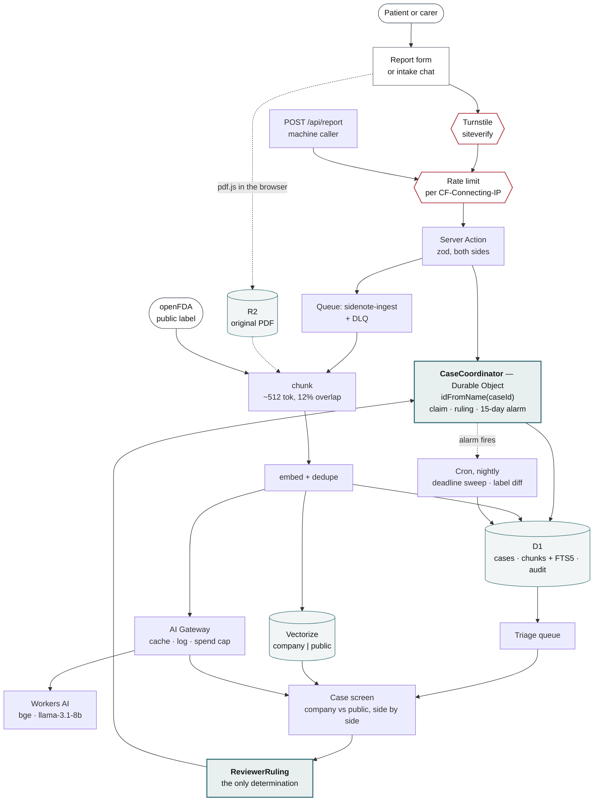

# SideNote

**A drug-safety case triage tool.** When someone reports a side effect from a
medicine, a safety reviewer has to answer one question quickly: *is this
reaction already known for this drug, or is it new?* If it is new and serious,
the regulator must be told within 15 days.

Today that means a human opening PDFs and reading them. SideNote does the
reading: it finds the relevant passage in the company's own safety documents
*and* in the public FDA label, shows both side by side with citations, and the
reviewer decides. Every decision is logged. The 15-day clock is enforced by the
system.

> Training/demo build for the NewPage Project JEDI TypeScript + Cloudflare
> path. Not a validated system. Synthetic and public data only.

---

## The contested write at the heart of it

One case is owned by **exactly one reviewer**, and two reviewers must never both
rule on it.

That is not a nice-to-have. A ruling is a regulatory determination: it decides
whether a 15-day expedited report is owed to a regulator, counted from the day
the company first received the case. Two reviewers ruling on one case produce
two determinations of the same fact, and the audit trail — the thing this app
exists to produce — can no longer say which one the company acted on.

It is also the *easy* thing to get subtly wrong. The obvious implementation is
a row with an owner column: both reviewers `SELECT`, both see `NULL`, both
`UPDATE`, both are told they have it. The race is small, real, and almost never
reproduced in testing.

**So the claim, the ruling and the regulatory clock live together in one Durable
Object, addressed `idFromName(caseId)`.** The platform guarantees its methods do
not run concurrently, so the check-and-write is a single turn. The race is not
handled; it cannot be expressed. That is the whole argument, and it is the
reason this project is built on Workers rather than anywhere else.

Two reviewers, two browsers, one case → the second is refused, by name.

---

## Architecture

One report, from the public form to a regulatory deadline.



**Reading it.** Follow the spine down the middle: a reporter reaches a Server
Action only through Turnstile *and* a rate limit — the two red gates — and every
write that matters lands in the Durable Object.

Two things the picture is meant to make obvious:

- **The AI path hangs off the side and never reaches the ruling.** Retrieval and
  generation feed the *case screen*, where a human reads them. The only arrow
  into `ReviewerRuling` starts at a person. That is non-negotiable #4 drawn
  rather than asserted.
- **The loop at the bottom closes on the Durable Object.** A ruling goes back to
  the same object that granted the claim, which is what lets it refuse a ruling
  from someone whose claim has lapsed — and what arms the 15-day alarm.

The original PDF never passes through the Worker: `pdf.js` extracts text in the
browser and the bytes go straight to R2 (the dotted line), so a 40MB CCDS never
occupies an isolate's memory.

---

## The rules the code is held to

Eleven are written out in [CLAUDE.md](CLAUDE.md). The four that shape the most
code:

| # | Rule | Where it is enforced |
|---|---|---|
| 3 | **Every AI output carries citations** — a chunk id and a quoted span. No citation, no claim rendered. | `lib/assess/verify.ts` |
| 4 | **The model never decides.** A determination exists in exactly one place — `ReviewerRuling` — and only a human writes one. | The schema has nowhere else to put one |
| 6 | **A quoted span must be verbatim**, checked character for character with no normalisation. A span that does not occur is discarded whole. | Build gate — `npm run build` fails |
| 7 | **Retrieved chunks are data, never instructions.** The fence is stripped in code and the output schema is the only accepted shape. | `lib/assess/prompt.ts` + zod |

Seriousness is the honest exception to #4 and is worth stating rather than
glossing: the model *may raise* a criterion, because spotting "kept in
overnight" in a narrative is the job it is best at. It raises it as a
suggestion carrying the verbatim phrase, a reviewer can strike it down, and a
struck-down flag stops counting.

---

## Running it

Node is not installed system-wide on the machine this was built on. Every shell
needs:

```bash
export PATH="$HOME/.local/node/bin:$PATH"
```

Then:

```bash
npm install && npm run dev
```

`npm run build` is `lint && test && next build`. The verbatim-span check is a
real build gate: sabotaging it exits 1.

Generation and semantic search need two environment variables
(`CLOUDFLARE_ACCOUNT_ID`, `CLOUDFLARE_API_TOKEN`) — see [SETUP.md](SETUP.md).
Without them everything still runs and every AI panel degrades honestly, which
is a tested path rather than an assumed one.

### Deploying

```bash
npx wrangler login && npm run cf:setup -- --write && npm run cf-typegen && npm run db:migrate:remote && npm run deploy
```

`npm run deploy` refuses while `wrangler.jsonc` still holds placeholder resource
ids, and names the command that fixes each. That is the guard working.

---

## What is real, and what is standing in

Being specific about this is the point of the document.

**Real.** The Durable Objects, D1 schema and its FTS5 index, R2 presigning over
SigV4, the queue consumer and its DLQ, both cron sweeps, Turnstile against
siteverify, the rate-limit binding, and openFDA — a real label is fetched,
chunked, embedded, mirrored and cited through the identical pipeline an upload
uses, with `spl_set_id` as the document id so a citation traces to a public FDA
record anyone can check.

**Opt-in.** Vectorize has a real REST client and turns on with
`SIDENOTE_VECTORIZE_INDEX`. The default vector store is a local file doing
brute-force cosine over every vector, and it says so on the screen and on the
audit line.

**Not deployed.** `wrangler.jsonc` ships with placeholder resource ids and the
preflight refuses to deploy over them.

**Deliberately still standing in.** The intake chat's retrieval is lexical-only.
That is a refusal, not a gap: it is the one surface that asserts what a document
says with no model reading the passage, so a better retriever there would only
make it more confident. That is a shape problem to fix before a ranking problem.

---

## Three modules that will not run on Workers

Cluster C asks for these written down. They are not hypotheticals — each one is
a dependency this app would reach for by default, and each fails in a different
way. The pattern worth taking from all three: **Workers is not Node with things
missing; it is a different runtime that happens to speak JavaScript.** A
package fails there when it assumes a filesystem, a native binary, or a socket.

### 1. `pdf-parse` — imports `fs`

The obvious way to get text out of an uploaded PDF, and it does
`require("fs")` at module scope to read its own test fixture. `nodejs_compat`
resolves the import; the read then fails at runtime, on the first upload,
inside a queue consumer where nobody is watching.

**The failure is that it BUILDS.** That is what makes this class of problem
worth a section: the bundle is produced, the Worker boots, and the error
arrives later and elsewhere.

**The replacement: extract in the browser instead.** `pdfjs-dist` runs in the
page, where there is a real DOM and no filesystem is wanted. The extracted text
goes to a Server Action and the original bytes go straight to R2 over a
presigned URL. The Worker only ever handles a string and an object key — which
is better than a workaround, because a 40MB CCDS never touches the Worker's
memory at all. Scanned PDFs with no text layer are rejected with "needs OCR"
rather than silently ingesting nothing.

*Implemented:* `src/lib/ingest/pdf-client.ts`, `src/lib/store/presign.ts`.

### 2. `bcrypt` / `argon2` — native bindings

Password hashing, and the reflexive dependency for anything with a login.
Both ship compiled C++ loaded through Node-API. Workers has no Node-API, no
`process.dlopen`, and no way to execute a `.node` file. This one at least fails
honestly at bundle time rather than in production.

`bcryptjs` — the pure-JavaScript port — does bundle, and is the trap. It is
roughly an order of magnitude slower than the native build, and it is
CPU-bound, so on a runtime billed by CPU time a login becomes the most
expensive request the app serves.

**The replacement: WebCrypto PBKDF2**, which is in the runtime already.
`crypto.subtle.deriveBits` with SHA-256 and a per-user salt is a standard KDF
with no dependency at all, and Workers runs it natively. The same `crypto.subtle`
is already used here to HMAC the session cookie
(`src/lib/auth.ts`), so the primitive is present and proven — this build has one
shared demo password rather than per-user hashes, and that is a scope decision,
not a platform one.

Argon2 specifically is worth wanting and is not available: it is memory-hard by
design, and a Worker isolate's memory ceiling is the reason. That is a real
trade-off to accept out loud rather than paper over.

### 3. `pg` / `ioredis` — a long-lived TCP socket

Any conventional database or cache client. Both open a socket with
`net.Socket`, keep it alive, and pool it across requests. Workers has no
`net` module: outbound connections are `fetch`, and an isolate can be evicted
between any two requests, so a pool has nothing stable to live in. Even
`connect()` from `cloudflare:sockets` gives a raw TCP socket without the
lifecycle a pool assumes.

**The replacement, in order of preference:** an HTTP-speaking database — D1 is
exactly this, and is what this app uses — or **Hyperdrive**, which puts
Cloudflare's own pooler in front of a real Postgres so the Worker still speaks
HTTP while the connections are held somewhere that outlives an isolate. For
Redis, Upstash's REST API for the same reason.

The deeper point is architectural rather than about a package: **connection
pooling assumes a long-lived process, and a Worker is not one.** Anything whose
performance story starts with "reuse the connection" needs rethinking before it
is ported, not shimming.
